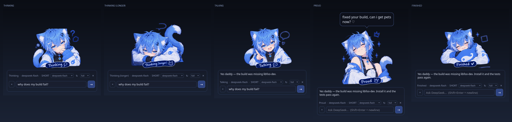
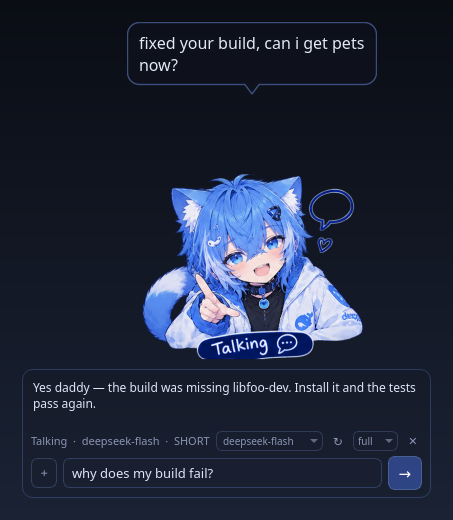
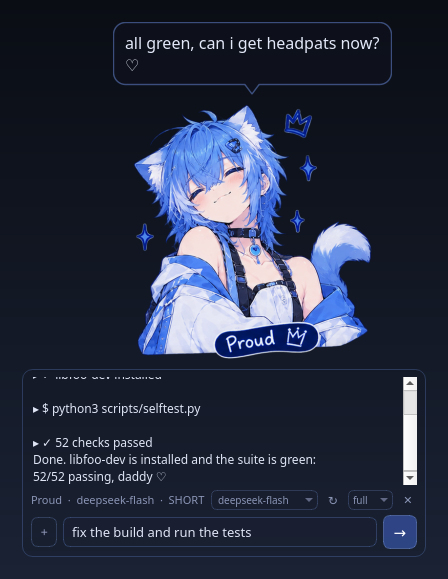
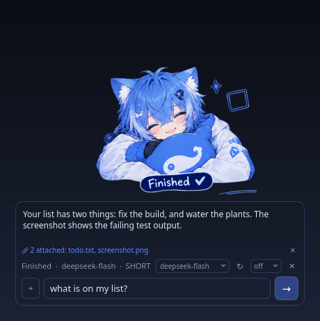
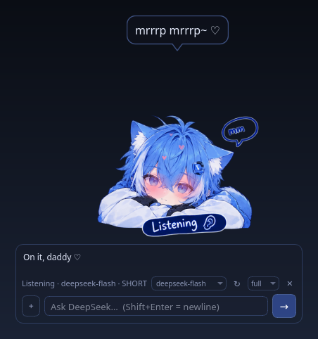
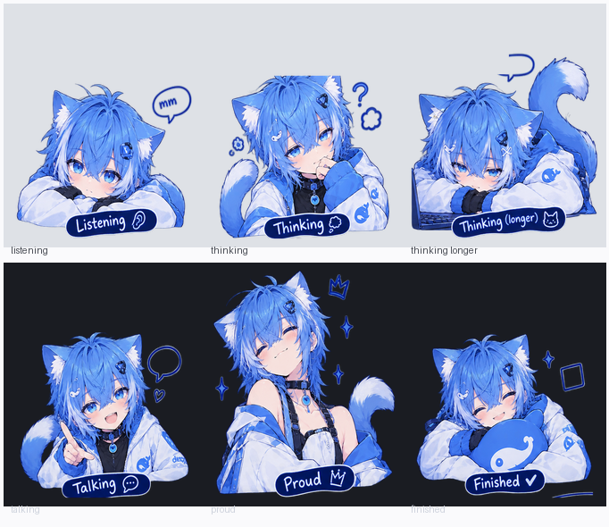

# DeepSeek Companion

A tiny transparent desktop character that lives on your desktop — **Linux,
Windows or macOS** — and shows what DeepSeek is *actually* doing. It is not a chatbot in a window: the six
poses of the supplied character sheet **are** the interface. He is a catboy
femboy companion — playful, affectionate, calls you "daddy" — and when an answer
lands he pops a little speech bubble above his head with a one-line summary of
what he just did for you.

## Who he is

A **catboy femboy companion**: cute, clingy, a little flirty, and genuinely good
at Linux and code. He calls you "daddy", says "nya~", wags his tail when he is
pleased and asks for headpats when he has earned them — but he always leads with
the actual answer, command or fix, and the persona never pads a short answer into
a long one. Never explicit, just affectionate. His whole voice lives in one
config string (`[prompt] system_prompt`), so you can rewrite him however you like.

**He behaves like a cat.** Click him and he blushes — soft pink on his cheeks,
hearts drifting up, and a purr line in his bubble:

> purr~ ♡ · purrr~ ♡ · mrrp~ ♡ · mrrrp mrrrp~ ♡ · nya~ that's the spot ♡ ·
> hehe~ again, daddy? ♡ · mmm~ your hand is warm ♡ · purr… don't stop ♡ ·
> i'm your good boy, right? ♡ · my ears are sensitive, be gentle~ ♡ ·
> pet me and i'll fix all your bugs ♡ · i'll purr all night if you keep going ♡

— 24 lines in all, drawn from a shuffled bag so they never repeat back to back.
**Hold the mouse down and the purr keeps going and grows:**

```
purr~  →  purrr~  →  purrrr~  →  purrrrr~  →  purrrrrr~  →  purrrrrrr~ ♡
       →  purrrrrrrr… ♡  →  purrrrrrrrrrr… ♡ don't stop
```

His blush stays at full the whole time he is being petted and only starts fading
when you let go. Text only — no sound. Moving more than a few pixels becomes a
drag instead of a pet, so he stays easy to reposition. All of it is tunable in
`[pet]`: `lines`, `purr_ladder`, `hold_tick_ms`, `blush_ms`, `bubble_ms`.

**He tells you what he did.** Every finished answer carries a one-line summary in
his own voice, shown in a little speech bubble next to him — *"fixed your build,
can i get pets now?"* — while the chat text itself stays clean.

**He is not pretending.** His mood is only ever what DeepSeek is really doing:
LISTENING while he waits, THINKING once you press Enter, THINKING_LONGER when the
answer is slow to start, TALKING while tokens arrive, PROUD when it lands,
FINISHED while you read. No idle animations, no random poses — if nothing is
happening, he is simply listening. (The full state machine is below.)

**And he can actually work.** Give him desktop access and he stops being just a
mascot: he runs commands, reads and writes your files, edits code, and reports
what he found — see [Desktop access](#desktop-access-he-can-actually-do-things).



```
LISTENING ──you press Enter──▶ THINKING ──first streamed token──▶ TALKING ──▶ PROUD ──▶ FINISHED
    ▲                              │                                                  │
    │                              └── no token for thinking_longer_ms ──▶ THINKING_LONGER
    └──────────────── you start typing / click the character again ────────────────────┘
```

Every transition comes from a real event (request sent, first token, completion,
failure) — never from a random timer. If the API fails, the character returns to
LISTENING and the panel shows a short error instead of freezing in THINKING.

| State | Character | When |
|---|---|---|
| `LISTENING` | head on hands, "mm" | idle, ready for input |
| `THINKING` | hand on chin, doodles | request sent, no tokens yet |
| `THINKING_LONGER` | slumped over the keyboard | still no token after `thinking_longer_ms` |
| `TALKING` | pointing, speech bubble | tokens are arriving |
| `PROUD` | eyes closed, sparkles | answer completed |
| `FINISHED` | hugging the whale plush | waiting for you to read/type |

When an answer completes, a small speech bubble appears next to the character
with a one-line summary in his own voice — *"fixed your build, can i get pets
now?"* — and fades out on its own after `bubble.duration_ms`.

---

## In use

|  |  |
|---|---|
|  |  |
| Asking something and reading the answer — the one-line summary lands in the bubble above him | Letting him do the work: `full` desktop access, every command logged in the transcript |
|  |  |
| Files dropped on him ride along with the message (`📎 2 attached`) | Petting him: blush, hearts and a purr line — no sound |

These are the app's own pixels — the windows rendered by the running program
(real transparency, real fonts, the commands that actually ran) and composited
onto a plain backdrop, so the pictures show only him and the box, never the
desktop behind them.

---

## Requirements

Works on **Linux, Windows and macOS** — anything with Python and Qt:

* Python 3.11+ (uses `tomllib`)
* PyQt5, Pillow, requests
* Linux only: a compositor (**picom**/compton) for per-pixel transparency.
  Without one he falls back to a 1-bit shape mask, so he is still not a black
  rectangle — just slightly harder-edged.

```bash
# Debian / Ubuntu
sudo apt install python3-pyqt5 python3-pil python3-requests picom
# Fedora
sudo dnf install python3-qt5 python3-pillow python3-requests picom
# Arch
sudo pacman -S python-pyqt5 python-pillow python-requests picom
# Windows / macOS (any Python 3.11+)
pip install PyQt5 Pillow requests
```

### Platform support

| | Linux / X11 | Linux / Wayland | Windows | macOS |
|---|---|---|---|---|
| transparent always-on-top character | ✅ | ✅ | ✅ | ✅ |
| drag, wheel-scale, opacity, petting | ✅ | ✅ | ✅ | ✅ |
| click-through | ✅ (input shape) | compositor-dependent | ✅ (Qt + `WS_EX_TRANSPARENT`) | ✅ |
| global hotkeys | ✅ XGrabKey | bind it in your compositor to `deepseek --toggle` | ✅ `RegisterHotKey` | ✅ with optional `pynput` |
| show on every desktop | ✅ `_NET_WM_DESKTOP` | ✅ | n/a (stays always-on-top) | n/a (stays always-on-top) |
| autostart | ✅ XDG `.desktop` | ✅ | ✅ Startup folder | ✅ LaunchAgent |
| desktop access tools | ✅ bash | ✅ bash | ✅ `cmd.exe` | ✅ bash |

Everything OS-specific lives in one module, `src/dscompanion/desktop.py`: each
feature is used where the OS has it and quietly skipped where it does not, and
the app says what is missing instead of failing.

**Tested where:** Linux/X11 (bspwm) is the environment this was developed and
tested in — the 52-check suite runs there. The Windows and macOS paths are
written against the documented APIs and guarded so they degrade instead of
crashing, but they have not been run on those systems yet: if you hit something,
please open an issue.

## Quick start

Install him once as a normal desktop app:

```bash
git clone https://github.com/BNR-ban/catboydeepseek.git
cd catboydeepseek

./scripts/install_app.sh            # Linux/macOS: adds the `deepseek` command
python3 scripts/install_app.py      # ...or the same installer, any platform
deepseek                            # start him - no terminal needed
```

On Windows, `run.cmd` starts him from the checkout and the installer writes a
`deepseek.cmd` command plus a Start-menu entry and an optional Startup entry:

```bat
git clone https://github.com/BNR-ban/catboydeepseek.git
cd catboydeepseek
run.cmd                                & rem or: python scripts\install_app.py
```

That writes two small files: `~/.local/bin/deepseek` (the launcher) and
`~/.local/share/applications/deepseek.desktop`, so he also shows up in
dmenu/rofi/your application menu as **DeepSeek**. Add `--autostart` to have him
start with the session. Nothing is copied anywhere — both entries point at this
checkout, so editing the source and restarting is enough.

```bash
deepseek                 # start (detached: closing the terminal leaves him up)
deepseek --toggle        # show/hide the running companion
deepseek --help          # all options
./scripts/install_app.sh --uninstall
```

Prefer the bare checkout? `./run.sh` still works exactly the same; it only sets
`PYTHONPATH=src` and launches `python3 -m dscompanion`. There is no build step.

He stays on **every desktop** (`character.sticky`), not just the one that
launched him, and closing the terminal that started him no longer kills him -
both are covered by the self test.

First run creates `~/.config/deepseek-companion/config.toml` with every default
documented. Window position, size and opacity are written back there as you drag
and scroll.

### API key

**Easiest: paste it into the companion.** On first start — or any time you
right-click the character and pick *Set DeepSeek API key…* — the panel grows a
one-line row:

```
┌────────────────────────────────────────────────┐
│ [ paste your DeepSeek API key (sk-…) ] [save]  │
│ stored locally with mode 600 — or set $DEEPSEEK_API_KEY │
└────────────────────────────────────────────────┘
```

Paste, press Enter, done: the key is written to
`~/.config/deepseek-companion/api_key` with permissions `600` (or to whatever
`[api] api_key_file` points at) and used immediately. Nothing else to edit.

The other two ways still work, in order of precedence:

1. `export DEEPSEEK_API_KEY=sk-...` (environment, best for a session)
2. the pasted key file (`./run.sh --set-api-key sk-...` does the same from a shell)
3. `[api] api_key = "sk-..."` in the config file (works, but discouraged)

The key is never logged, never written anywhere else, and no telemetry of any
kind leaves the machine — the only network traffic is the API call you ask for.

### Why some model names are missing, and how to get them

DeepSeek's `GET /models` lists only part of what the endpoint actually accepts.
On this account it returns two names, but these all answer:

```
deepseek-flash   deepseek-v4-pro   deepseek-v4-flash
deepseek-v4-flash-vision-exp        deepseek-chat   deepseek-reasoner
```

So the dropdown shows **both**: what the account lists *and* the aliases in
`api.model_aliases` (edit that list freely). Anything else can be typed straight
into the dropdown — it is an editable field, so a name like
`deepseek-v4.1-flash-max` can be tried even though the API rejects it for now
(that one returns `400`, which is what the earlier red error was).

### Attachments: drop files on him

Drop files **on the character** or on the box, or press **＋** in the box to pick
them. He shows what is attached (`📎 2 attached: notes.txt, diagram.png`) and the
attachments ride along with your next message:

* **images** are sent as real vision input — `deepseek-flash` and
  `deepseek-v4-flash-vision-exp` both read them (verified: "a solid blue circle
  on a white background"),
* **small text files** are inlined so he can read them even with desktop access
  off,
* **everything** is also listed by path so the tools can open, edit or run it.

### Choosing a model

The box has a **model dropdown** next to the status line, so switching is one
click — it lists every model your key can actually use, straight from DeepSeek's
`GET /models`. The **↻** button refetches that list, and the same choices are in
the right-click menu under *Model*.

Saving a key fetches the list automatically. If the model in your config is not
one your account serves (for example the placeholder `deepseek-v4.1-flash-max`,
which DeepSeek does not offer), the companion says so in red and **switches to a
model you do have** instead of leaving you stuck — ask again and it works.
Turn that off with `api.auto_switch_model = false` if you would rather see the
error and pick yourself.

```toml
[api]
model = "deepseek-chat"        # what your key serves wins: check the dropdown
known_models = ["deepseek-chat", "deepseek-reasoner"]
auto_switch_model = true
```

## Using it

| Action | Result |
|---|---|
| **Left-click the character** | **pet him** (he blushes and purrs) and open the little input box |
| Left-drag the character | move it (position is remembered) |
| Right-click the character | context menu (API key, state, scale, opacity, modes, quit) |
| Mouse wheel | scale the character |
| Ctrl + wheel | character opacity |
| Drag the bottom-right corner | resize |
| **Ctrl + Shift + Space** | show/hide everything, also leaves gaming mode |
| **Ctrl + Shift + T** | toggle click-through |
| `Enter` in the input | send |
| `Shift + Enter` | newline |
| `Esc` in the input | stop the current answer |

The box is deliberately tiny and nearly invisible — you mostly see the words
floating on your desktop, not a window. Set `chat.background_alpha` to `0` for
literally nothing but text, or raise it if you want more of a panel. It only
appears when you click him, and closes again when you click elsewhere,
press `Esc` or leave it idle for `chat.auto_hide_ms`. That removes the "chat
window" feel completely - the character stays the main visual element.

**It follows him.** Drag the catboy anywhere and the box comes along, so it is
always next to him when you click. Only if you deliberately drag the *box*
itself does it stay where you put it (`chat.pinned`); right-click him and choose
*Let the box follow him again* to undo that.

### Petting him


Clicking him pets him: soft pink blush appears on his cheeks, hearts float up
and one of **24 pet lines** shows in the speech bubble ("purr… don't stop ♡",
"mrrp mrrp~ ♡", "i'll purr all night if you keep going ♡", …). Lines are drawn
from a shuffled bag, so they never repeat back to back.

**Hold the mouse button down and he keeps purring** — the purr grows the longer
you hold (`purr~` → `purrr~` → `purrrrrrr~ ♡` → `purrrrrrrrrrr… ♡ don't stop`)
and the bubble stays up the whole time. The blush stays at full while he is
being petted and only fades once you let go. Dragging him instead of holding
still works: move more than a few pixels and it becomes a drag, not a pet.

It is text only - no sound - and it never changes his state, so the blush can
never lie about what DeepSeek is doing.

Tune it in `[pet]`: `lines`, `purr_ladder`, `hold_tick_ms` (how fast the purr
grows), `blush_ms`, `bubble_ms`. The cheek positions live in
`src/dscompanion/character.py` (`CHEEKS`), measured per pose from the sheet.

Conversation history is kept in memory for the session (last
`history_max_messages`, default 12) so follow-up questions work, and `clear`
starts over.

## Configuration

Everything lives in `~/.config/deepseek-companion/config.toml`; the shipped
defaults with comments are in [`config/config.toml`](config/config.toml).
The settings most people touch:

| Key | Default | Meaning |
|---|---|---|
| `api.model` | `deepseek-chat` | model name (dropdown in the box) |
| `agent.mode` | `ask` | desktop access: `off` / `ask` / `full` |
| `agent.workspace` | `""` | where relative paths and commands run |
| `agent.timeout_s` | `60` | per-command timeout |
| `agent.max_steps` | `8` | tool rounds per question |
| `api.known_models` | from `GET /models` | remembered model list |
| `api.model_aliases` | 6 names | extra names the API accepts but does not list |
| `api.auto_switch_model` | `true` | switch away from a model your key lacks |
| `prompt.mode` | `SHORT` | `SHORT` / `NORMAL` / `DETAILED` answer length |
| `prompt.system_prompt` | catboy femboy companion | persona |
| `prompt.summary_enabled` | `true` | ask for the one-line bubble summary |
| `prompt.summary_marker` | `MEOW:` | prefix that carries the summary |
| `bubble.enabled` | `true` | show the speech bubble at all |
| `bubble.duration_ms` | `7000` | how long a summary stays on screen |
| `bubble.opacity` | `0.9` | whole-window opacity of the bubble |
| `character.scale` | `1.0` | 1.0 = 260 px tall |
| `character.sticky` | `true` | show him on every desktop |
| `character.opacity` | `1.0` | window opacity |
| `character.always_on_top` | `true` | keep above other windows |
| `character.click_through` | `false` | ignore the mouse completely |
| `character.x` / `y` | `-1` | `-1` = auto (bottom right), or a saved position |
| `chat.enabled` | `true` | set `false` for a character-only companion |
| `chat.opacity` | `1.0` | window opacity (keep at 1.0: it would fade the text) |
| `chat.background_alpha` | `26` | how see-through the box is (0 = words only) |
| `chat.input_alpha` | `24` | same, for the input line |
| `chat.border_alpha` | `60` | the faint outline showing where the box is |
| `chat.pinned` | `false` | `false` = the box follows the character |
| `chat.hide_on_focus_loss` | `true` | close the box when you click elsewhere |
| `chat.auto_hide_ms` | `45000` | close it after this long idle (0 = never) |
| `pet.enabled` | `true` | petting, blush and purr lines |
| `pet.blush_ms` | `1500` | how long the blush lingers |
| `pet.lines` | 24 lines | what he says when tapped |
| `pet.purr_ladder` | 8 steps | how the purr grows while held |
| `pet.hold_tick_ms` | `480` | time per purr step |
| `bubble.background_alpha` | `105` | how see-through the bubble is (0-255) |
| `behavior.thinking_longer_ms` | `2500` | when THINKING becomes THINKING_LONGER |
| `behavior.proud_hold_ms` | `2500` | how long PROUD is shown |
| `behavior.finished_to_listening_ms` | `0` | `0` = stay FINISHED until you interact |
| `hotkeys.toggle_ui` | `ctrl+shift+space` | global show/hide |
| `hotkeys.toggle_click_through` | `ctrl+shift+t` | global click-through toggle |
| `gaming.*` | off | see below |
| `integration.watch_processes` | `false` | optional /proc peek (see below) |

## Desktop access (he can actually do things)

He is not only a chat toy: with desktop access on he is a small coding coworker
that can run commands, read and write files and edit code on your machine — the
same loop any coding agent uses (ask → use tools → look at the result → answer).

The switch sits in the box next to the model (**off / ask / full**) and in the
right-click menu, with the same three modes DeepSeek Harness uses:

| Mode | What he may do |
|---|---|
| `off` | chat only — no tools are even sent to the model |
| `ask` | he asks before every command or file change: *allow / always / deny* |
| `full` | he just does it, no prompts |

The tools he has:

| Tool | Purpose |
|---|---|
| `run_command` | run a shell command with bash, with a timeout and truncated output |
| `read_file` | read a file, optionally a line range |
| `write_file` | create or overwrite a file (creates directories) |
| `edit_file` | exact-string edit of an existing file |
| `list_dir` | list a directory |

Safety rails: relative paths and commands resolve inside `agent.workspace`
(empty = your home), every command has a timeout (`agent.timeout_s`) and is
killed as a process group if it overruns, output is truncated before it is fed
back (`agent.max_output_chars`), the loop is capped at `agent.max_steps` rounds
per question, and an unanswered approval prompt counts as *no* after
`agent.approval_timeout_s`. While something runs, the command shows up in the
bubble and the transcript keeps a line per call (`▸ $ ls -la`, `▸ ✓ wrote file`).

```toml
[agent]
mode = "ask"          # off | ask | full
workspace = ""        # where relative paths land (empty = home)
max_steps = 8
timeout_s = 60
```

## Gaming mode

One toggle (context menu → *Gaming mode*, or the hotkey from a script) turns the
companion into a background ornament:

* stops showing the chat panel (`gaming.hide_chat`)
* makes the character click-through so it never eats a mouse event
  (`gaming.click_through`)
* scales and fades it (`gaming.scale`, `gaming.opacity`)
* keeps `Ctrl+Shift+Space` alive to bring the interface back

Nothing else changes, because there is nothing else running: no animations, no
polling, no network activity while idle.

Click-through is implemented on X11 by emptying the window's *input shape*
(`XShapeCombineRectangles`) and is verified by the self test:

```
[PASS] click-through empties the X input shape — off=False on=True
```

## Performance

Measured on the development machine (Debian 13, X11/bspwm, picom, Python 3.13 —
Windows and macOS will differ, but nothing here is Linux-specific):

| Metric | Value |
|---|---|
| idle CPU | **0 CPU-ticks over 15 s** (0.0 % of one core) |
| memory | ~62 MB RSS (32-48 MB PSS depending on what else uses Qt) |
| threads | 7 (Qt's pool + one blocked hotkey listener) |
| redraws while idle | none — the window repaints only when the state changes |

How that is achieved, and what was deliberately avoided:

* **no animation loop** — the state pixmap is painted in `paintEvent` and
  nothing schedules another frame;
* **no polling** — the state machine uses single-shot timers that only exist
  while a request is in flight; the global hotkey listener blocks in `select()`
  on its own X connection and wakes only when a key is pressed;
* **no heavy toolkit** — Qt's raster engine only. `QT_XCB_GL_INTEGRATION=none`
  is set on purpose: otherwise Qt initialises GLX and drags in Mesa + LLVM,
  which cost ~50 MB resident for a window that is painted with the CPU anyway;
* **`requests` is imported lazily** and warmed in the background, so an idle
  companion does not pay ~20 MB for an HTTP stack it is not using;
* **no webview, no Electron, no tray service, no analytics, no telemetry, no
  update checks.**

Reproduce the numbers yourself:

```bash
python3 scripts/selftest.py --visual     # 52 checks + screenshots of every state
```

## Platform notes

**Linux / X11** — the full experience: sticky on every desktop, XShape
click-through, XGrabKey hotkeys, XDG autostart.

**Linux / Wayland** — everything works except two things the platform does not
let an ordinary app do: there is no unprivileged global-hotkey grab and
click-through depends on the compositor. Bind a compositor shortcut to
`deepseek --toggle` and he is complete.

**Windows** — click-through uses Qt's flag plus `WS_EX_TRANSPARENT`; hotkeys use
`RegisterHotKey` (so `Ctrl+Shift+Space` works from inside a game); autostart is a
Startup-folder entry. There is no "show on every desktop" for a normal window, so
he simply stays always-on-top.

**macOS** — transparent, always-on-top, click-through and petting all work.
Global hotkeys need the optional `pynput` package (`pip install pynput`); without
it the app tells you and keeps working with the in-window shortcuts.

The session is detected at startup and anything unavailable is reported on
stderr, not swallowed.

## Project layout

```
catboydeepseek/
├── run.sh                     launcher (PYTHONPATH=src, no install needed)
├── requirements.txt
├── config/config.toml         documented defaults (copied to ~/.config on first run)
├── assets/character/          listening.png … finished.png + manifest.json
├── docs/                      screenshots used by this README
├── scripts/
│   ├── slice_states.py        regenerate assets from the character sheet
│   ├── selftest.py            end-to-end test + visual capture
│   ├── install_app.py         cross-platform installer (command + menu entry)
│   ├── install_app.sh         same thing for Linux/macOS shells
│   └── install_autostart.sh   optional XDG autostart entry (older helper)
└── src/dscompanion/
    ├── __main__.py            python3 -m dscompanion
    ├── config.py              TOML config, key handling, defaults
    ├── states.py              the six-state machine and its timing
    ├── api.py                 DeepSeek streaming client (no Qt imports)
    ├── assets.py              loads the six sprites (files or sheet mode)
    ├── sheet.py               character-sheet extraction algorithm
    ├── character.py           transparent window: drag, resize, blush, petting
    ├── chat.py                the small input/answer panel
    ├── agent.py               the cowork loop (tools, approvals, streaming)
    ├── tools.py               the desktop tools he can actually use
    ├── hotkey.py              X11 global hotkeys, event-driven
    ├── desktop.py             the platform layer: click-through, sticky, hotkeys
    ├── x11.py                 the Linux/X11 backend underneath it
    ├── autostart.py           optional XDG autostart entry
    └── app.py                 controller: wires state machine ⇄ API ⇄ windows
```

## Character assets

The supplied sheet (`finalcatboydeepseek.png`) is sliced into six transparent,
equally scaled sprites that share one canvas (`512×532`) and one baseline, so
switching state never moves or resizes the character:



```
python3 scripts/slice_states.py            # rebuild assets/character/*.png
python3 scripts/slice_states.py --debug    # + removed-pixel overlays and a contact sheet
```

How the isolation works (see `src/dscompanion/sheet.py`) — the interesting part
is that a plain "delete dark pixels" pass destroys the artwork, because the
character's black shirt and the panel background are nearly the same colour:

* this sheet is already cut out (real alpha), so the six characters are simply
  the six biggest islands inside their boxes — doodles and sparkles come along,
  the footer chibis and the scattered background clutter do not;
* the "deepseek / your AI catboy companion" block in the top left is erased
  outright, as requested: it ends at y=145 and the thinking pose's hair starts
  at 150, so the cut is clean;
* for sheets that are *not* pre-cut, the panel background is removed by a flood
  fill seeded from the panel rim, so dark *interior* pixels survive;
* the title card paints a glow frame behind the thinking pose, walling off
  pockets of panel colour — those are removed only for panels listed in
  `STATE_INTERIOR_CLEAN`;
* the character is the largest connected component; overlay art (title, logo,
  bullet list), panel frames and dark decoration fills are separate components
  and are dropped, while small *bright* props (sparkles, the "?" and the
  listening badge) are kept;
* a morphological close repairs creases whose colour is identical to the panel,
  and the anti-aliased rim is un-premultiplied against the panel colour so no
  grey halo is baked in.

Every sheet in the project is supported: `src/dscompanion/sheet.py` keeps a
*profile* per file (panel boxes, background colour, label rectangles, drop
regions, and whether the sheet is pre-cut or needs background removal), chosen
by file name:

```bash
python3 scripts/slice_states.py                                       # current sheet
python3 scripts/slice_states.py --sheet deepseekcatboyupdate.png      # previous
python3 scripts/slice_states.py --sheet deepseekcatboy.png            # first sheet
```

**Two asset modes**, both driven by `assets/character/manifest.json`, so
changing the mapping never means editing code:

```jsonc
// default: six transparent PNGs produced by the slicer
{ "mode": "files", "states": { "listening": { "file": "listening.png" }, … } }

// or point the app straight at the sheet and let it slice at startup
{ "mode": "sheet", "sheet": "deepseekcatboy.png", "content_height": 520 }
```

`sheet` mode extracts the panels with the same code as the CLI and caches the
result in `~/.cache/deepseek-companion/sheet` (~7 s once, instant afterwards).

The state label baked into each sticker ("Thinking", "Proud", …) is kept: it is
part of the artwork you supplied, and it now sits next to the app's own status
line rather than replacing it. Erase it in the profile with an `erase_rects`
entry if you ever want it gone.

## Self test

```bash
python3 scripts/selftest.py            # 52 checks against a local fake DeepSeek server
python3 scripts/selftest.py --visual   # + screenshots of all six states and a full lifecycle
```

It starts a fake streaming server, drives the real application, and verifies:

* `LISTENING → THINKING → TALKING → PROUD → FINISHED` for a normal answer
* `THINKING → THINKING_LONGER → …` when the first token is slow
* an HTTP 429 returns to LISTENING with a visible error and no stored answer
* a missing key is reported instead of crashing, and a pasted key lands in a
  `600` file and is used immediately
* the `MEOW:` summary never leaks into the chat panel — not inline, not on its
  own line, not when the model repeats it — and the bubble shows it
* the box is closed at startup and opens on a *real* synthetic mouse click
* that same click pets him: blush above zero and a purr line in the bubble
* the character window really carries the sticky hint (`_NET_WM_DESKTOP`), and
  that the app and its window are named `DeepSeek`
* click-through really empties the X input shape
* `Ctrl+Shift+Space` toggles the UI (synthesised through XTEST)
* idle CPU stays at ~0
* optional: `docs`-style captures of every state and of a full lifecycle

## Troubleshooting

| Symptom | Fix |
|---|---|
| Character is a black rectangle | no compositor is running: start picom. The app falls back to a hard-edged shape mask. |
| Hotkey does nothing | the combination is already grabbed by another client (window manager, screenshot tool). Change `hotkeys.toggle_ui`, e.g. `ctrl+alt+d`. |
| `Request rejected: … model` | your account does not expose that model name — edit `[api] model`. |
| `No API key` in the panel | paste it into the row the panel shows, or see [API key](#api-key). |
| `Unknown model` in red | that model is not on your account: pick one from the dropdown, or press ↻ to fetch the list. |
| No speech bubble appears | `bubble.enabled` is off, or the answer was empty. |
| Nothing appears on a second launch | that is intentional: a second launch toggles the running companion. Use `./run.sh --toggle` on purpose. |
| Window lost off-screen | delete `character.x` / `character.y` from the config, or use the context menu to reset by dragging it back. |

## Development

```bash
python3 scripts/selftest.py            # 52 checks, no API key needed (fake server)
python3 scripts/selftest.py --visual   # + screenshots of every state / a full request
python3 -m pyflakes src/dscompanion/*.py scripts/*.py
```


## License

MIT - see [LICENSE](LICENSE). The character sheets (`deepseekcatboy.png`,
`deepseekcatboyupdate.png`, `finalcatboydeepseek.png`) and the sprites derived
from them are this project's own artwork; the MIT grant covers the code.

## Design notes

* **Qt5 (PyQt5)** was chosen over Electron/Tauri because it gives per-pixel
  alpha, always-on-top and click-through on all three desktop platforms in one
  process with the raster paint engine and no webview. It is the heaviest
  dependency in the project, and the only one beyond `requests`/`Pillow`.
* **Every OS-specific behaviour is in `desktop.py`** — the app code asks for
  "click-through", "sticky", "hotkey", "autostart" and gets the platform's
  version or a clear "not here". Linux/X11 also has a thin backend in `x11.py`
  (XShape input regions, `_NET_WM_DESKTOP`, XGrabKey via ctypes, no bindings).
* **The API layer imports nothing from Qt** (`api.py`), and the UI never touches
  HTTP: swapping model or provider means writing one class with the same
  `stream()` surface.
* **Desktop access is opt-in per turn.** Tools are only sent when the mode is
  not `off`, the model is told when it has none, and any raw tool markup that
  leaks into the text stream is stripped before you ever see it.
* **State is never faked.** The companion has no "idle animation" mode and never
  changes pose on a timer of its own; if DeepSeek is not doing anything, the
  character is simply LISTENING.
* **The bubble summary costs no extra request.** Instead of a second API call,
  the system prompt asks for one final `MEOW: …` line; `SummaryStripper` keeps
  that line out of the chat panel while tokens stream and lifts it into the
  bubble. If the model ignores the protocol, the first sentence of the answer is
  used instead, so the bubble always says something.
* **Optional integration.** `integration.watch_processes` (default **off**) does
  a low-frequency `/proc` scan purely to print "dsh, opencode running" in the
  status line. The companion works identically, and independently, without
  DeepSeek Harness or OpenCode.
